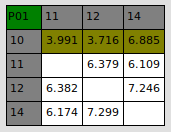

# GUI for Trajectory Benchmarking with Indoor GPS
## **Project Description**
The goal of the project is to develop a GUI application which can record and compare trajectory points of a mobile robot. we used Marvelmind Indoor GPS to track the robots path.
* The project contains a submodule from marvelmind robotics which includes a class based on threading for receiving and parsing coordinates data from Marvelmind mobile beacon.
* We have used PyQt5 along with Qt Designer for the GUI. The [user interface (GUI_window.ui)](src/GUI_Window.ui) designed by Qt Designer can be translated into a [python file (GUI_window.py)](src/GUI_Window.py).
* The GUI application is executed in the [main](src/main.py) program. Other programs in [Scripts](src/scripts) directory contains tab-wise helper functions that are imported in the main program.
### Details
1. Programming Language : Python
2. Required version : 3.6 
3. GUI Design Software : Qt 5 Designer

## **Marvelmind Setup**

* Setup the Stationary and Mobile beacons with the help of the [marvelmind software](https://marvelmind.com/pics/marvelmind_SW_2021_01_31.zip). The software setup manual can be found [here](https://marvelmind.com/pics/marvelmind_navigation_system_manual.pdf)


* To install marvelmind dashboard on linux follow the instructions on [this installation manual](https://marvelmind.com/pics/dashboard_linux_manual.pdf) after downloading the software.
* For 3-D application minimum **3-Stationary Beacons** are required and a maximum of 4 is allowed per sub-map. we have **1-Mobile Beacon** which will be placed over the robot.
* The Stationary Beacons will take some time to measure the distance between them so that it can form a map. check Table of distances.

* If you see in the table some cells marked yellow/red, it denotes the measurements inconsistent. Try to re-position them because usually there is an obstruction of some sort in the between the beacons. The cells must be colored in white before freezing the sub-map.
 
* The Stationary beacons should not be moved from their position after this setup. In case if it is moved, then we need to do the setup again.

## **Execution Instruction**

The GUI application can be started either by running the python file [main.py](src/main.py) or by running the executable file.
1. Python file
    * Follow the first 2 step mentioned in the [Installation](#installation)
    * Run the following command to install the software [requirements](requirements.txt)
    ```
    pip install -r requirements.txt
    ``` 
    * Start GUI application
    ```
    python3 src/main.py
    ```
2. Executable file
    * We are using PyInstaller to build all the programs and libraries of the project into single distribution package. The builded distribution package might not be compatible to PC of other OS versions. 
    * We recommend to execute the all step mentioned in the [Installation](#installation)
    * The builded distribution package can be in dist directory. This can be runned with the following command.
    ```
    ./dist/main
    ```
    Note : The exe file can be copied and runned in any PC with same OS version but make sure the file is executable

## **GUI Usage**

1. Live Tab
  
  * This tab shows the live position of the mobile beacon. 
  * The animation can be enabled or disabled by checking or unchecking the show Trajectory check box.
  * The value Buffer size corresponds to the number of recent position that needs to be plotted on the map. i.e If the Buffer size is 1000 last 1000 points is plotted on the map. 
2. Set Origin Tab
  
  * By default, one the Stationary beacon is setted as the origin. If we want to provide a local origin for the robot, we can use the options in this tab.
  * Clicking "OK" will set current position of the mobile beacon as the origin.
  * This Origin can be saved as a file with extension (*.origin) by clicking "Save" button.
  * with "Open" and "apply" buttons, we can load a saved (*.origin) file and set it as the orign for our frame of reference.
  * "Reset" and "Cancel" button reset the origin back to world origin coordinates (0,0,0).
3. Waypoint Record Tab
  
  * The waypoints will be recorded in a csv file. the filename format is *RobotName_RunName_TimeStamp"
  * Robot name and Run name can be selected in corresponding dropdown menus.
  * The "Record" button should be clicked everytime to record a new point.
  * "Stop" button is clicked when current path is ended. It'll close the file and clears the map for next iteration.
4. Trajectory Record Tab
  
  * Same as the waypoints, the trajectory will also be recorded in a csv file with similar filename format.
  * Once the "Record" button is clicked the robots entire path is recorded in the file untill "Stop" button is pressed.
  * The recorded plot can be still seen in the window. Click "Clear" to earse the map for next iteration.
5. Compare Tab
  
  * Use the "Open" buttons to select the waypoint files that needs to be compared.
  * Selected files will be plotted immediately on the map.
  * Click the "Compare" button to compute and visualize the difference value between two corresponding waypoints.   

## **Installation**

Please follow the instructions to build distribution package compatible for your PC current OS.

1. Run the following command to give rights for your user to access serial port by adding current user to dialout group.
    ```
    sudo adduser $USER dialout
    ```

2. Clone the Repository along with the Marvelmind submodule.
    ```
    git clone https://github.com/Kabilan-T/GUI_for_Trajectory_Benchmarking_with_Indoor_GPS.git
    ```
    ```
    cd GUI_for_Trajectory_Benchmarking_with_Indoor_GPS
    ```
    ```
    git submodule init
    ```
    ```
    git submodule update
    ```

3. Initialize the virtual environment
    * Install pip (if not available)
    ```
    apt-get update && install python3-pip
    ```
    * Install pipenv (if not available)
    ```
    python3.6 -m pip install install pipenv
    ```
    * Initializing pipenv environment
    ```
    pipenv install
    ```
    * Activate environment
    ```
    pipenv shell
    ```
    * Deactivate from environment
    ```
    exit
    ```
4. Create the exe file (Suitable for the current Operating System)
    ```
    pyinstaller --onefile src/main.py
    ```
    Note: environment can be deactivated now
5. Make the exe file as executable
    ```
    sudo chmod +x dist/main
    ```
## **Other Useful Commands**
* Command to view data received from modem
    ```
    python src/MarvelmindRobotics/src/example_matplotlib.py 
    python src/MarvelmindRobotics/src/example.py
    ```
* Command for installing Qt5 Designer
    ```
    sudo apt-get install qttools5-dev-tools
    sudo apt-get install qttools5-dev
    ```
* Converting ".ui" to ".py" with PyQt5
    * Command usage : 
        ```
        pyuic5 -x [Qt_Design_FILENAME].ui -o [Python_FILENAME].py
        ```
    * Command : 
        ```
        pyuic5 -x src/GUI_Window.ui -o src/GUI_Window.py
        ```
* PyInstaller
    ```
    pyinstaller --onefile src/main.py
    ```

